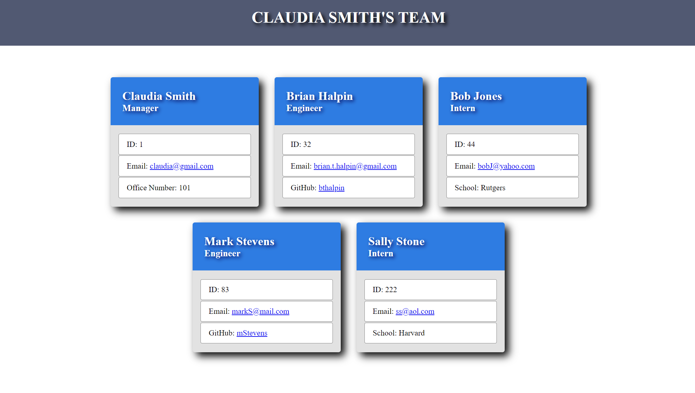

# Team Management System

## Description
The Team Management System is a Node js app that dynamically creates an HTML page and CSS file of the user's team information.  Upon entering the information in the terminal, the app displays the information in an easy to read layout.

## Table of Contents

[Installation](#installation)

[Media](#media)

[Usage](#usage)

[License](#license)

[Contributing](#contributing)

[Tests](#tests)

[Questions](#questions)

## Installation
To install the necessary dependencies, run the following command:

    npm install

## Usage
Clone the repo and install the depenecies.  Run the app with npm start, enter the information and the app will create the team.html and style.css file in the dist folder.

## Media
[Team Management System Demo](https://watch.screencastify.com/v/NP0P3SgVlLlBy0fHp7MO)

The following image shows an example of the team layout:

## License
This product is licensed under MIT

## Contributing
No contributions at this time.

## Tests
To run tests, run the following command:

    npm test

## Questions
If you have any questions about the repo, open an issue or contact me directly at <brian.t.halpin@gmail.com>. You can find more
    of my work at [Brian Halpin](https://github.com/bthalpin).
